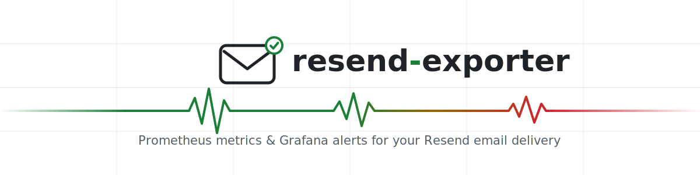
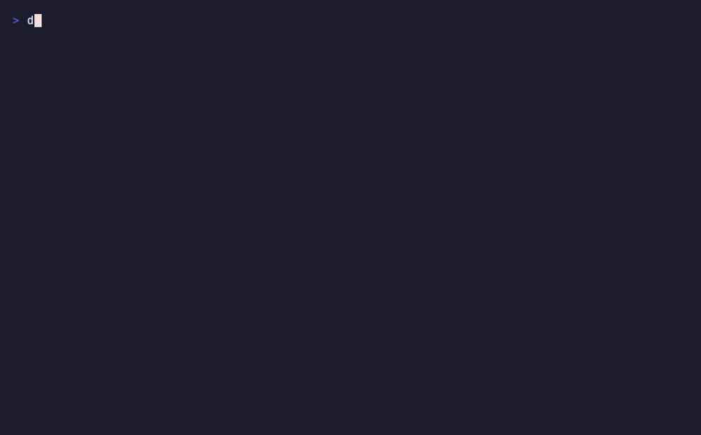
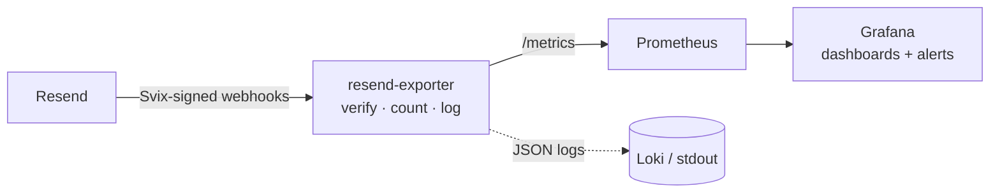
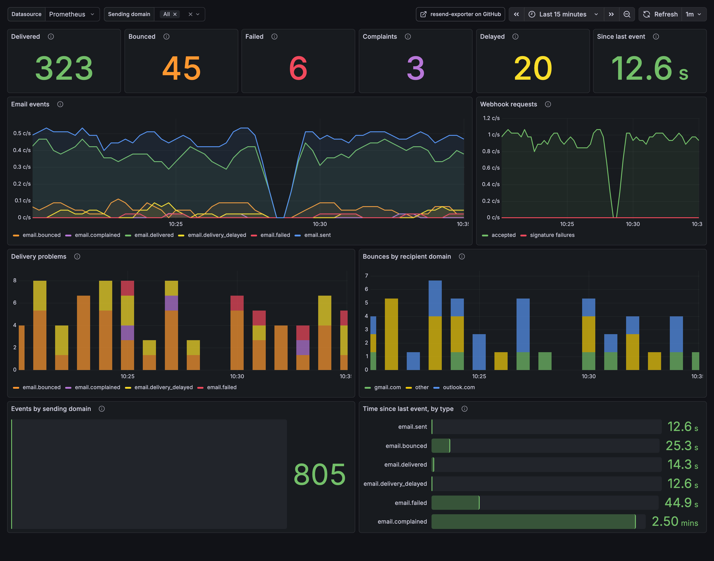

<picture>
  <source media="(prefers-color-scheme: dark)" srcset=".github/assets/banner-dark.svg">
  
</picture>

<p align="center">
  <a href="https://github.com/robbeverhelst/resend-exporter/actions/workflows/ci.yaml"></a>
  <a href="https://github.com/robbeverhelst/resend-exporter/releases"></a>
  <a href="https://github.com/robbeverhelst/resend-exporter/pkgs/container/resend-exporter"></a>
  <a href="LICENSE"></a>
</p>

<p align="center">
  <a href="#quickstart">Quickstart</a> ·
  <a href="#the-dashboard">Dashboard</a> ·
  <a href="docs/metrics.md">Metrics</a> ·
  <a href="docs/alerting.md">Alerting</a> ·
  <a href="docs/deployment.md">Deployment</a>
</p>

---

Your transactional email fails silently: the appointment confirmation bounces, the password reset never arrives, and you find out from a support ticket three days later. Resend knows the moment it happens — **resend-exporter** turns that moment into a Prometheus alert.

It receives Resend webhook events, verifies their [Svix](https://docs.svix.com) signatures, and exposes clean Prometheus metrics — so the monitoring stack you already run pages you when email breaks.

<p align="center">
  
</p>

## Why this exists

- **Alert on what matters** — a bounced confirmation email is an incident, not a dashboard curiosity. `increase(resend_email_events_total{event_type="email.failed"}[5m]) > 0` and you're paged.
- **Metrics stay clean, logs stay detailed** — counters answer _"how many & how bad"_, structured JSON logs answer _"which email & why"_. Recipient addresses and subjects are redacted or hashed by default, so metrics and dashboards are safe to share.
- **Cardinality-safe by construction** — recipient domains are bucketed (well-known providers keep their name, the long tail becomes `other`), so one busy tenant can't blow up your Prometheus.
- **Boring to operate** — a single compiled binary in a distroless image, three runtime dependencies, no database, no Resend API key needed.

## How it works



| Method | Path               | Purpose                       |
| ------ | ------------------ | ----------------------------- |
| `POST` | `/webhooks/resend` | Receive Resend webhook events |
| `GET`  | `/metrics`         | Prometheus metrics            |
| `GET`  | `/healthz`         | Liveness probe                |
| `GET`  | `/readyz`          | Readiness probe               |

## Quickstart

**Docker**

```sh
docker run -p 8080:8080 \
  -e RESEND_WEBHOOK_SECRET=whsec_... \
  ghcr.io/robbeverhelst/resend-exporter:latest
```

**Helm**

```sh
helm install resend-exporter oci://ghcr.io/robbeverhelst/charts/resend-exporter \
  --set resend.webhookSecret=whsec_... \
  --set serviceMonitor.enabled=true
```

**Local playground** — exporter + Prometheus (alert rules loaded) + Grafana (dashboard provisioned):

```sh
docker compose up --build
```

Then point a Resend webhook at `https://your-host/webhooks/resend` (dashboard → Webhooks → Add, copy the `whsec_` signing secret) and scrape `/metrics`. The webhook path needs to be internet-reachable; `/metrics` should not be. Details in [docs/deployment.md](docs/deployment.md).

## The dashboard

Ships in [`examples/grafana/dashboards/`](examples/grafana/dashboards/resend-exporter.json) — import it, or let the compose playground / your dashboard sidecar provision it:

<p align="center">
  
</p>

## Metrics

```text
resend_webhook_events_total{event_type="email.bounced",domain="acme.dev"}
resend_email_events_total{event_type="email.bounced",from_domain="acme.dev",to_domain="outlook.com"}
resend_webhook_signature_failures_total
resend_webhook_handler_errors_total{reason="invalid_json"}
resend_webhook_last_event_timestamp_seconds{event_type="email.delivered"}
```

Full reference and the cardinality design: [docs/metrics.md](docs/metrics.md). Ready-made alert rules (any failure, bounces, repeated delays, signature failures, stale webhook): [docs/alerting.md](docs/alerting.md) and [examples/prometheus/alerts.yml](examples/prometheus/alerts.yml).

## Configuration

| Variable                              | Required | Default            | Description                                                                      |
| ------------------------------------- | -------- | ------------------ | -------------------------------------------------------------------------------- |
| `RESEND_WEBHOOK_SECRET`               | yes      | —                  | Svix signing secret (`whsec_...`) from the Resend webhook settings               |
| `RESEND_EXPORTER_ADDR`                | no       | `:8080`            | Listen address (`host:port` or `:port`)                                          |
| `RESEND_EXPORTER_WEBHOOK_PATH`        | no       | `/webhooks/resend` | Webhook path                                                                     |
| `RESEND_EXPORTER_METRICS_PATH`        | no       | `/metrics`         | Metrics path                                                                     |
| `RESEND_EXPORTER_LOG_LEVEL`           | no       | `info`             | `debug`, `info`, `warn`, `error`                                                 |
| `RESEND_EXPORTER_REDACTION_MODE`      | no       | `strict`           | `strict`, `hash`, or `none` — see [docs/configuration.md](docs/configuration.md) |
| `RESEND_EXPORTER_TO_DOMAIN_ALLOWLIST` | no       | —                  | Extra recipient domains kept as their own `to_domain` label value                |

## Documentation

- [Configuration](docs/configuration.md) — every environment variable, redaction modes
- [Metrics](docs/metrics.md) — metric reference and cardinality design
- [Alerting](docs/alerting.md) — PromQL alert examples for Grafana/Alertmanager
- [Deployment](docs/deployment.md) — Docker, Helm, docker-compose, exposing the webhook
- [Development](docs/development.md) — building, testing, and the release process

## Roadmap

- Optional Resend API reconciliation: backfill missed events after downtime, verify webhook configuration, and enrich sparse events (`RESEND_API_KEY` is already reserved for this)
- Delivery-delay histogram and bounce-type breakdown metrics
- PrometheusRule support in the Helm chart

Non-goals: replacing the Resend dashboard, storing email content, and sending alert notifications directly — routing belongs in Grafana Alerting, Alertmanager, ntfy, Slack, or PagerDuty.

## Contributing

PRs welcome — see [CONTRIBUTING.md](CONTRIBUTING.md). The short version: `bun install`, `bun test`, conventional commits (every `feat:`/`fix:` on `main` ships a release automatically).

## License

[MIT](LICENSE)
